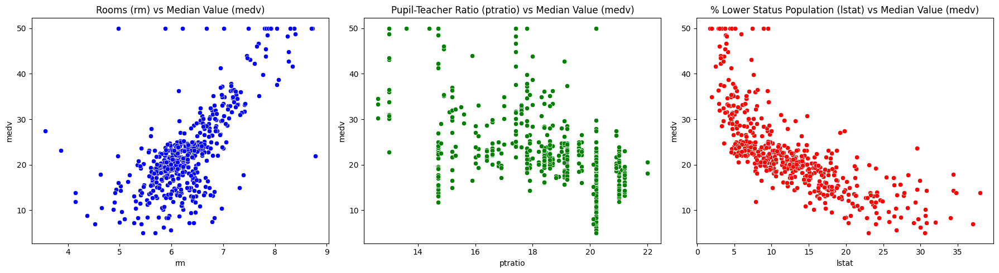

# Boston Housing Linear Regression Practice

This project applies linear regression to the Boston Housing dataset to study the relationships between housing prices and socioeconomic/environmental factors. The focus is on statistical inference: interpreting coefficients, understanding feature importance, and exploring how variables relate to median housing prices, rather than optimizing predictive performance (will do that in the future as I dive deeper into data science and machine learning, tackling analytics for now).

## Dataset

- Source: Scikit-learn's Boston Housing dataset (CSV version)
- Shape: 506 rows × 14 columns
- Target variable: medv (Median value of owner-occupied homes in $1000's)

## Tools Used

- Python
- pandas, matplotlib, seaborn, statsmodels.api 
- Jupyter Notebook
- Git & GitHub for version control

## Insights

- Correlation analysis shows that rm (average number of rooms) is strongly positively correlated with housing prices, while lstat (percentage of lower-status population) and ptratio (pupil–teacher ratio) are strongly negatively correlated. Other variables such as tax, nox, and indus also show moderate negative correlations.

    
    
      

- Simple Linear Regression (medv ~ lstat): Higher values of lstat are associated with lower housing prices. The model explains about 54% of the variance in prices (R² ≈ 0.54), highlighting the strong influence of socioeconomic status.

    
      

- Multivariate Regression (medv ~ lstat + rm + ptratio): Incorporating rm and ptratio improves explanatory power (R² ≈ 0.68). Larger homes (rm) positively affect prices, while higher lstat and ptratio values reduce prices. All three variables are statistically significant, reinforcing their importance in understanding housing price variation.

    